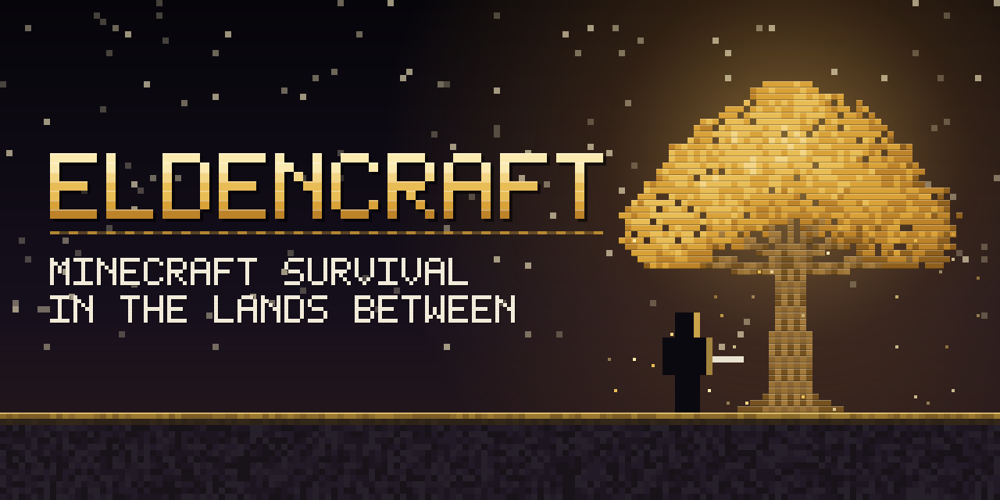

# EldenCraft

**Minecraft survival, combat and building inside Elden Ring’s actual world.**

Explore the Lands Between with Minecraft movement, hearts, armour, tools and inventory. Gather wood and ore, craft equipment, place blocks among Elden Ring’s ruins, and fight its enemies with Minecraft weapons. Elden Ring keeps running the world, bosses, quests, interactions and grace respawns.

EldenCraft runs both games together. A native mod inside Elden Ring connects to a hidden Minecraft instance and draws Minecraft’s blocks, equipment and HUD into the game you are playing.

[Download the latest release](https://github.com/wargamereview-ship-it/EldenCraft/releases/latest) · [Boss reward list](rewards.md) · [Roadmap](roadmap.MD) · [Building from source](docs/BUILDING.md)

> **Offline only.** Launch through EldenCraft’s shortcut or me3 so Easy Anti-Cheat is bypassed and Elden Ring stays offline. Never take the modded game online.

## Gameplay

### Play as a Minecraft character

You move, jump, swim and fight with Minecraft’s controls, hearts, armour and inventory. Minecraft owns movement from the moment you spawn, and the view starts level and follows Minecraft’s mouse look. The Elden Ring character is hidden, including while Elden Ring plays its own death. Press **F8** for Minecraft’s pause menu to change settings or GUI scale.

### Build in the Lands Between

Minecraft blocks occupy real positions in Elden Ring’s world. Place structures around the terrain, use crafting tables, furnaces and chests, and build in Limgrave, underground caves and the DLC’s regions. Elden Ring’s own terrain and structures stay intact.

The bridge reads Elden Ring’s collision, so you can walk across hills, rubble and ruins, through connected caves, and ride lifts. Blocks are hidden behind the game’s scenery using its depth buffer, so pillars, ruins and grass can cover your creations correctly, and block lighting can follow the game’s picture.

### Start empty and gather your equipment

A fresh character has an empty inventory. Find outdoor log piles and loose stone, then work toward tools, smelting and better equipment through Minecraft’s crafting.

- Logs and loose stone can be gathered bare-handed; loose stone gives cobblestone.
- Larger rocks need a pickaxe and can hold copper in early regions or iron in later ones.
- Eight mapped mine interiors supply regional ore: coal, copper, iron, gold, diamonds and ancient debris in higher tiers.
- Depleted deposits come back after you rest at a grace. They leave your built blocks alone and stay clear of graces you have rested at.

### Fight Elden Ring enemies with Minecraft weapons

Minecraft calculates your damage, cooldowns, criticals and enchantments. The bridge delivers each hit through Elden Ring’s combat, so enemies stagger, react and guard as they normally do, and they hear your footsteps.

- Enemies show their real names (Wolf, Godrick Soldier, …) with a health bar. Enemies the name list does not cover show their model number.
- Your **Minecraft hearts** are your health. Incoming hits pass through Minecraft armour, absorption and shield blocking. At zero hearts, Elden Ring’s normal death and grace respawn run, and you keep your inventory.
- The combat HUD shows the target’s health, accepted hits, criticals and shield blocks. Arrows stay stuck in enemies.

### Collect boss rewards

Ordinary enemies drop materials by family and region (five tiers in the base game, two more in Shadow of the Erdtree), and enemies carrying gear sometimes drop it. Each of the **208 boss encounters** gives a named item at full durability, an enchanted book and regional materials, once per encounter per world.

- **17 four-piece armour collections** with their own trims.
- **Boss-themed weapons**: swords, axes, spears, maces, tridents, bows and crossbows that match the boss’s weapon style, element or status.
- Rewards wait for you through death or a full inventory.

See [every boss’s item, enchantments and book](rewards.md). Kills also drop XP orbs, which repair Mending gear.

### Elden Ring enchantments and wards

Weapons can carry **Glintstone, Flame, Lightning or Sacred** damage, scaled by enemy family, and **Bloodletting, Frostbite, Venom or Scarlet Rot** that build up on enemies like Elden Ring’s own: bleed and frostbite burst, poison and rot deal damage over time, and frostbite leaves the target more vulnerable. Projectile Protection, Smite and Knockback also work against Elden Ring’s arrows, undead and stagger.

Eight armour wards protect you, 10% a level up to 70% at VII:

| Ward | Protection |
| --- | --- |
| Glintstone, Flame, Storm, Sacred | Reduces that element’s share of an incoming hit |
| Rot, Bleed, Frost, Venom | Reduces that status’s buildup from attacks |

Only your strongest piece for a ward counts. Themed bosses give warded armour and books; the rare VII books come from selected Shadow of the Erdtree bosses.

### See your statuses

Poison, scarlet rot, blood loss, deathblight, frostbite, sleep and madness on your character show as Minecraft effects with their own icons. A status HUD lists only statuses that are building or active, with the buildup percentage or the remaining time.

### Keep Elden Ring’s interactions

Press **R** to open doors, pull levers, pick up items and rest at graces. During the animation Elden Ring takes the body and Minecraft follows it.

## Install

You need:

- the **Steam edition of Elden Ring**, installed and launched once, on executable version **2.7.1**
- a Microsoft account that owns **Minecraft: Java Edition**
- internet access for the first setup

| Platform | Installer |
| --- | --- |
| Windows 10/11 x64 | Windows installer |
| Linux x86-64 / Steam Deck (desktop mode) | Linux installer, with Steam’s Proton selected for Elden Ring |

macOS support through CrossOver is experimental and not part of every release.

1. Download your platform’s ZIP from the [latest release](https://github.com/wargamereview-ship-it/EldenCraft/releases/latest).
2. Extract the **whole ZIP** into a writable folder. Close Elden Ring, Prism and Minecraft.
3. Run **Install.cmd** on Windows, or `sh Install.sh` on Linux.
4. When asked, enter your **Elden Ring folder**, its **Game** folder, or the full **eldenring.exe** path, for example `D:\SteamLibrary\steamapps\common\ELDEN RING`.
5. Setup downloads verified dependencies, installs the mod and creates shortcuts. Prism opens: sign in with your Minecraft account, let the instance reach Minecraft’s title screen, then close Minecraft and Prism.
6. With Steam running, start **Play EldenCraft**. Minecraft launches alongside Elden Ring and stays hidden. Load your Elden Ring save and you are playing as a Minecraft character.

No system Python, Java, Rust or Gradle is needed. Existing saves, accounts and unrelated Minecraft mods are preserved. To update, run the new release’s installer over the old one; it repairs managed files and keeps backups under `EldenCraft/backups`. **Finish Minecraft setup** resumes an interrupted sign-in, and **Check EldenCraft** verifies the game build and installed files. More options are in the [installer guide](installer/README.md).

## Controls

| Key | Action |
| --- | --- |
| F8 | Open Minecraft’s pause menu (options, video settings, GUI scale) |
| F9 | Toggle the Minecraft camera |
| F5 | Cycle Minecraft’s camera modes |
| F10 | Hand mouse and keyboard to Elden Ring or back |
| R | Elden Ring interaction (doors, levers, pickups, graces) |
| F3 | Block occlusion: game depth or scanned collision |
| F4 | Block lighting: game picture or clock model |
| F7 | Show nearby collision edges (debugging) |

Escape opens Elden Ring’s own menu. The R bridge assumes Elden Ring’s Event Action is bound to **E**. Minecraft’s usual inventory, crafting, mining, placement and weapon controls apply while it owns input.

## Roadmap

The full plan is in [roadmap.MD](roadmap.MD). In short:

1. **Play-check the newer systems:** wards, weapon elements and statuses, XP orbs and Mending, boss reward details, and the status mirror.
2. **Finish the survival loop from an empty start:** gather, craft a first real upgrade, build a base, leave and return.
3. **Crafting and building progression:** balance tool, armour, repair and enchanting costs against drops and deposits.
4. **Survival and combat balance:** hunger and healing against Elden Ring’s damage, weapon feel and stagger.
5. **Loot and collections:** tune regional rewards, then add armour set bonuses.
6. **Later:** villager traders, ladders and rarer interactions, native Elden Ring elemental and status effects, seamless co-op, and the Nether and End.

## Known limits

This is an early playable project. Exploration, connected caves, lifts, native interactions, ordinary combat, gathering, block occlusion, the pause menu, enemy names and Minecraft-first movement have been played on Linux/Proton. Windows and macOS gameplay are not confirmed.

- Rewards and gathering belong to the local host; seamless co-op is not implemented.
- Native terrain digging is disabled. Some deposits sit slightly above the visible ground because placement follows Elden Ring’s collision floor.
- Translucent native effects such as grace glows and particles can appear underneath blocks.
- If a graphics frame fails, EldenCraft restarts its renderer without game-depth occlusion and picture lighting rather than risk the game; blocks and the HUD keep working.
- Armour set bonuses, villager traders, Nether and End integration are future work.

## Troubleshooting

Start with **Check EldenCraft**, then confirm Steam is running, the supported game build is installed, and Minecraft finished its first preparation. Keep the logs before relaunching:

- Native bridge: `eldencraft.log` — installer deployments use `%LOCALAPPDATA%\EldenCraft\native\eldencraft.log`.
- Minecraft: `Prism/instances/EldenCraft/.minecraft/logs/latest.log` inside the installation folder.

Both logs print the mod version at startup (`EldenCraft 0.4.0 loaded`, `eldencraft 0.4.0`); include them when reporting a problem. Developers: see [building from source](docs/BUILDING.md).

EldenCraft is licensed under [MIT](LICENSE). Dependency sources and licences are listed in [the installer’s third-party notices](installer/THIRD_PARTY.md). Elden Ring and Minecraft belong to their respective rights holders.
